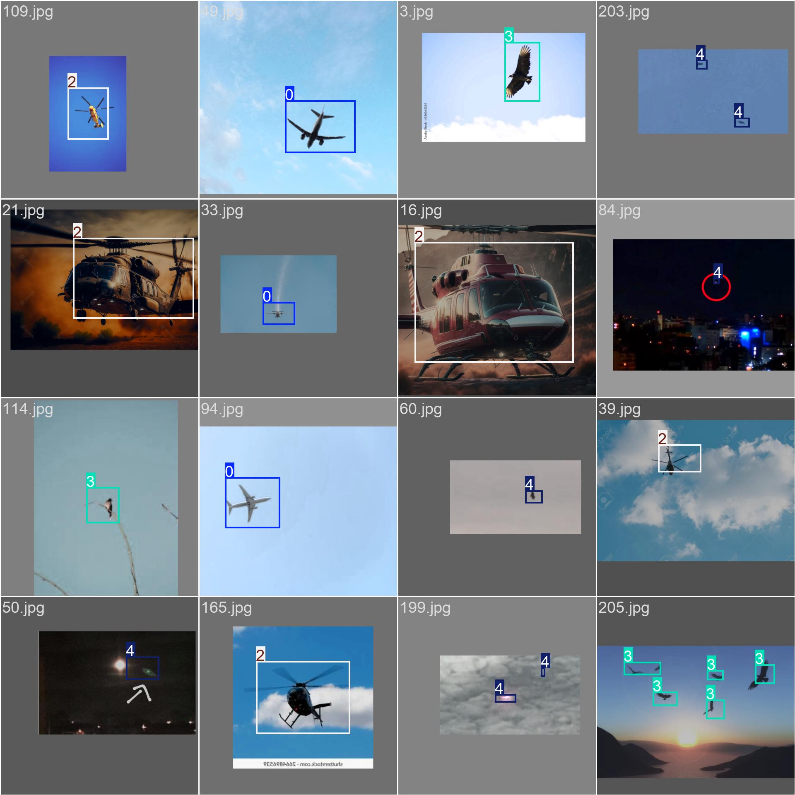

# Fly Detector

Small YOLOv8 example detecting flying objects. Trained on few images, it can analyze videos in real time. For demo and experimentation purposes.

## Passos para o desenvolvimento do software

- Criar o dataset com as imagens
    - Baixar as imagens
    - Criar as classes
    - Anotar as imagens
    - Dividir as imagens em treino e teste
- Configurar o arquivo data
- Treinar o modelo personalizado (YOLO)
- Testar o modelo

yolo detect train model=yolov8n.pt data=dataset/data.yaml epochs=50 imgsz=640 augment=true

yolo detect predict model=runs/detect/train/weights/best.pt source=videos 
